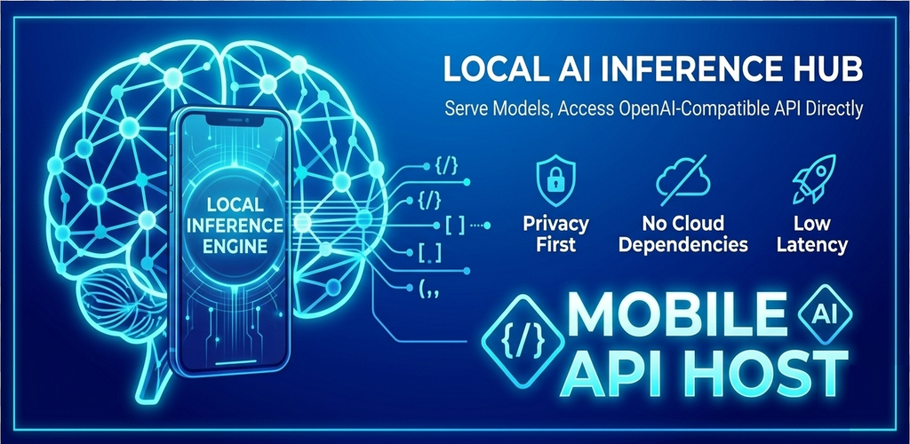

<div align="center">
  
</div>

# LiteRT LM API Server

[](./LICENSE)
[](https://developer.android.com)
[](https://kotlinlang.org)

> An Android library that turns on-device LLM inference into an OpenAI-compatible API server, powered by [Google LiteRT LM](https://ai.google.dev/edge/litert).

Turn any Android device into a local AI API endpoint. Run LLMs entirely on-device with LiteRT LM, and expose them through the standard OpenAI Chat Completions API — any client that works with OpenAI will work with this.

## ✨ Features

- 🤖 **On-Device Inference** — LLMs run locally via LiteRT LM, no internet required
- 🔌 **OpenAI-Compatible API** — Drop-in replacement for `/v1/chat/completions`, `/v1/models`, etc.
- 📡 **Streaming SSE** — Real-time token-by-token streaming, just like OpenAI
- 🛠 **Function Calling** — OpenAI-style tool/function calling support
- 🗂 **Session Management** — Multi-session with LRU eviction and auto-timeout
- 🔄 **Dynamic Model Switching** — Hot-swap models at runtime
- 🖼 **Multimodal** — Text + image inputs (base64 / URL / local file)
- ⚡ **Lightweight** — Minimal dependencies, runs as a foreground service

## Architecture

```
┌─────────────────────────────────────────┐
│          Any OpenAI Client               │
│   curl / OpenAI SDK / custom app / ...   │
└──────────────────┬──────────────────────┘
                   │ HTTP / SSE
                   │ :8080
┌──────────────────▼──────────────────────┐
│         ModelApiService (Ktor)           │
│  ┌──────────────┐  ┌────────────────┐   │
│  │ SessionMgr   │  │ DynamicToolSet │   │
│  │ (SessionMeta)│  └───────┬────────┘   │
│  └──────┬───────┘          │            │
│         └────────┬─────────┘            │
│           ┌──────▼──────┐                │
│           │ ModelEngine │                │
│           │  Manager    │                │
│           │ (Conv Cache)│                │
│           └──────┬──────┘                │
└──────────────────┼──────────────────────┘
                   │
           ┌───────▼───────┐
           │  LiteRT LM    │
           │  (on-device)  │
           └───────────────┘
```

## Quick Start

### 1. Add dependency

```kotlin
// build.gradle.kts
dependencies {
    implementation("dev.jenny.litertlm:litertlm-library:1.0.0")
}
```

### 2. Initialize

```kotlin
val manager = ModelEngineManager(context)
manager.loadModel(modelPath)

val server = LiteRtApiServer(manager)
server.start(port = 8080)
```

### 3. Call the API

```bash
curl http://<phone-ip>:8080/v1/chat/completions \
  -H "Content-Type: application/json" \
  -d '{
    "model": "gemma-4b",
    "messages": [{"role": "user", "content": "Hello!"}],
    "stream": true
  }'
```

## ✅ OpenAI API Compatibility

All core endpoints and parameters from the OpenAI Chat Completions API have been verified against real device tests (Gemma 3 1B IT-INT4 on Android). **18/18 tests passed.**

### Endpoints

| Endpoint | Method | Status |
|----------|--------|--------|
| `/health` | GET | ✅ Verified |
| `/v1/models` | GET | ✅ Verified |
| `/v1/chat/completions` | POST | ✅ Verified |
| `/v1/sessions` | GET | ✅ Verified |
| `/stats` | GET | ✅ Verified |

### Parameters

| Parameter | Status | Notes |
|-----------|--------|-------|
| `stream` (true/false) | ✅ | SSE streaming with `data: [DONE]` terminator |
| `messages` (system/user/assistant) | ✅ | Multi-turn conversation supported |
| `temperature` | ✅ | Sampling temperature control |
| `top_p` | ✅ | Nucleus sampling |
| `max_tokens` | ✅ | Response length limiting |
| `n` | ✅ | Multiple completions per request |
| `stop` | ✅ | Custom stop sequences |
| `model` | ✅ | Model selection (with graceful fallback for unknown models) |
| `stream` + `n` combined | ✅ | Streaming with multiple completions |

### Edge Cases

| Case | Status | Notes |
|------|--------|-------|
| `messages` omitted (null) | ✅ | Handled gracefully |
| Empty user content | ✅ | No crash |
| Unknown model name | ✅ | Falls back to loaded model |
| Stream chunk `role` field | ✅ | First chunk includes `"role": "assistant"` |

### Test Environment

- **Device:** Android 13
- **Model:** Gemma 3 1B IT-INT4
- **Server:** Ktor on port 8080
- **Date:** 2026-06-01
- **Result:** 18/18 passed, 0 failed

### Example Responses

**Non-stream:**

```json
{
  "choices": [{
    "finish_reason": "stop",
    "index": 0,
    "message": {"content": "Hello!", "role": "assistant"}
  }],
  "model": "gemma3-1b-it-int4",
  "object": "chat.completion",
  "usage": {
    "prompt_tokens": 14,
    "completion_tokens": 3,
    "total_tokens": 17,
    "context_remaining": 4079,
    "max_context_tokens": 4096
  }
}
```

**Stream (SSE):**

```
data: {"choices":[{"delta":{"role":"assistant"},"index":0}],"object":"chat.completion.chunk",...}
data: {"choices":[{"delta":{"content":"Hello!"},"index":0}],"object":"chat.completion.chunk",...}
data: {"choices":[{"delta":{},"finish_reason":"stop","index":0}],...,"usage":{"completion_tokens":3,...}}
data: [DONE]
```

> **Note:** The response includes an extra `session_id` field for session tracking, and `usage` includes `context_remaining` / `max_context_tokens` for on-device context window awareness. These are extensions beyond the standard OpenAI API.

## Project Structure

```
litertlm-api-server/
├── library/                            # 📦 Core Library (Apache 2.0)
│   └── src/main/kotlin/dev/jenny/litertlm/
│       ├── data/                        # ChatRequest, ChatResponse, Models
│       │   └── repository/             # IModelRepository, SharedPrefsRepository
│       ├── manager/                     # ModelEngineManager, SessionManager
│       ├── server/                      # ModelApiService (Ktor routes)
│       └── tools/                       # DynamicToolSet
├── app/                                # 📱 Pre-built APK (Proprietary)
├── LICENSE                             # Apache 2.0
└── README.md
```

## Supported Models

Any LiteRT LM compatible model (`.task` format):

- Gemma family (1B, 4B, 12B, 27B)
- DeepSeek R1 distilled
- SmolLM
- Custom converted models

## Building

### Core Library (AAR)

```bash
./gradlew :litertlm-library:assembleRelease
```

### APK

```bash
./gradlew :app:assembleRelease
```

Requirements: Android SDK 36, JDK 21, NDK (arm64-v8a).

## License

### Core Library — Apache 2.0

The core library (`library/`) is licensed under the [Apache License 2.0](./LICENSE).

You are free to use, modify, and distribute the library in your own projects, including closed-source applications.

### Android App — Proprietary

The Android application (`app/`) is **not open source**. Pre-built APKs are provided for download. See [app/LICENSE](./app/LICENSE) for details.

---

Made with ❤️ by Jenny
